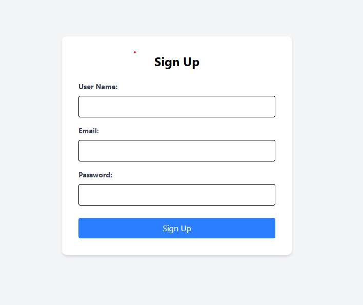

# Netflix Clone

This is a Netflix frontend website clone built using React, Tailwind CSS, and Firebase for authentication.

## Table of Contents

-   [Features](#features)
-   [Screenshots](#screenshots)
-   [Installation](#installation)
-   [Usage](#usage)
-   [Contributing](#contributing)
-   [License](#license)

## Features

-   User authentication with Firebase
-   Responsive design using Tailwind CSS
-   Browse and search for movies and TV shows
-   Watch trailers and get detailed information about each title

## Screenshots


_Home Page_


_Login Page_


_Movie Details_

## Installation

1. Clone the repository:
    ```bash
    https://github.com/Mijan2001/netflix-frontend.git
    ```
2. Navigate to the project directory:
    ```bash
    cd netflix-clone
    ```
3. Install the dependencies:
    ```bash
    npm install
    ```

## Usage

1. Start the development server:
    ```bash
    npm run dev
    ```
2. Open your browser and go to `http://localhost:5173`.
